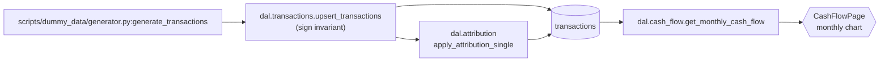

# diagrams/ — Mermaid lineage diagrams

One Mermaid `graph LR` per event type, plus one global overview. Built
last (Phase 4) once the YAML records are stable.

```
diagrams/
├── README.md                    ← this file
├── _overview.mmd                ← global event-class overlay
├── paycheck.mmd
├── mortgage_payment.mmd
└── …                            ← one .mmd per event id
```

## Per-event diagram

Shows origin → writes → derivations → UI surfaces. Node labels include
`file:symbol` so the diagram doubles as a clickable reference back to
the code.

Convention:



Node shape conventions:

- **Code (functions, classes):** rectangles `["file.py:symbol"]`
- **Tables / views:** stadium shape `[("table_name")]`
- **UI surfaces:** hexagon `{{"ComponentPath / page"}}`
- **External effects (SSE, files):** circle `(("topic_name"))`

## Global overview

`_overview.mmd` shows the four event classes (`user_action`,
`external_force`, `system_derived`, `live_only`) as super-nodes with
arrows showing the dominant write/read flow between them. One arrow
per dominant relationship, not per individual event. Goal: a one-page
mental model of "where does each kind of thing land."

## Generation

These files are GENERATED by `../build_diagrams.py`. Do not hand-edit;
edits belong in the source `../lineage/<event>.yaml`. After any
lineage YAML change, regenerate from `docs/data-lineage/`:

```
python build_diagrams.py
```

The generator walks `lineage/*.yaml`, emits one `<event_id>.mmd` per
event using the node-shape conventions above, and writes a global
`_overview.mmd` showing dominant write/read flow between the four
event classes. Node colors are assigned via Mermaid `classDef` so the
shapes carry their semantic meaning (origin vs. table vs. consumer
vs. derivation vs. ui vs. external effect) when rendered.

External-effect labels are extracted heuristically — "SSE <topic>"
prefix wins, then uppercase identifiers like `REFRESH_COMPLETE`, then
backticked tokens, with a max of 6 effects per diagram to keep the
graph legible. Full prose effects remain in the source YAML.

## Rendering

GitHub renders `.mmd` files as Mermaid by default in markdown blocks
but not as standalone files. To preview locally, paste the file's
contents into <https://mermaid.live> or use a VS Code Mermaid
extension. The README can also embed each diagram inline if linking
proves cumbersome.
